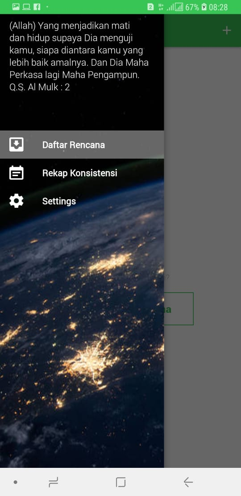
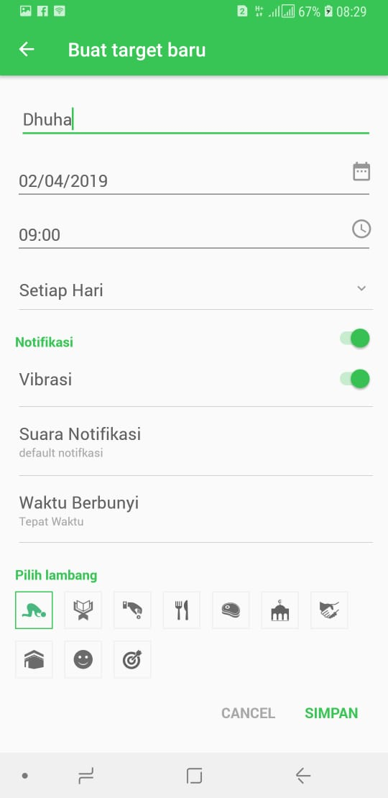
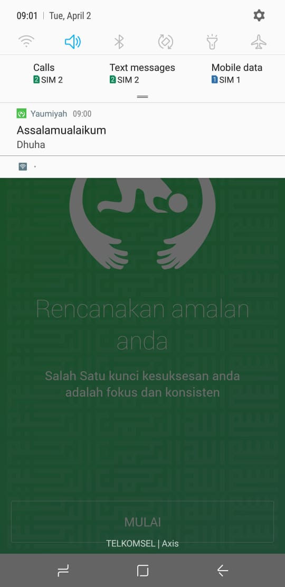

# Yaumiyah Android

<b>Unfinished</b> Moslem Daily worship evalution app for android project

Yaumiyah atau Mutaba’ah Yaumiyah adalah kegiatan evaluasi amal sehari – hari kita baik wajib maupun sunnah.
Aplikasi isi dibuat sebagai list dan reminder ibadah seorang muslim dan juga sebagai evaluasi ibadah harian,mingguan maupun bulanan.

</img>
</img>
</img>

 

</img>
</img>
</img>
</img>

#### Fitur
- Membuat daftar Ibadah harian
- Notifikasi pengingat ibadah
- Pilihan waktu pengigat (sekali,seminggu sekali,sebulan sekali,setahun sekali)
- Dapat memilih suara untuk notifikasi yang disediakan aplikasi maupun dari system android
- Pilihan simbol sesuai kegiatan ibadahnya
- Checklist daftar yang sudah dikerjakan
- Rekap konsistensi mingguan, bulanan atau semua kegiatan (digunakan sebagai pandauan evaluasi ibadah)

#### libs
* [AndroidViewAnimations](https://github.com/daimajia/AndroidViewAnimations)
* [NineOldAndroids](https://github.com/JakeWharton/NineOldAndroids)
* [Joda Time](https://www.joda.org/joda-time/)
